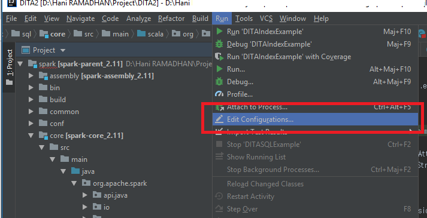
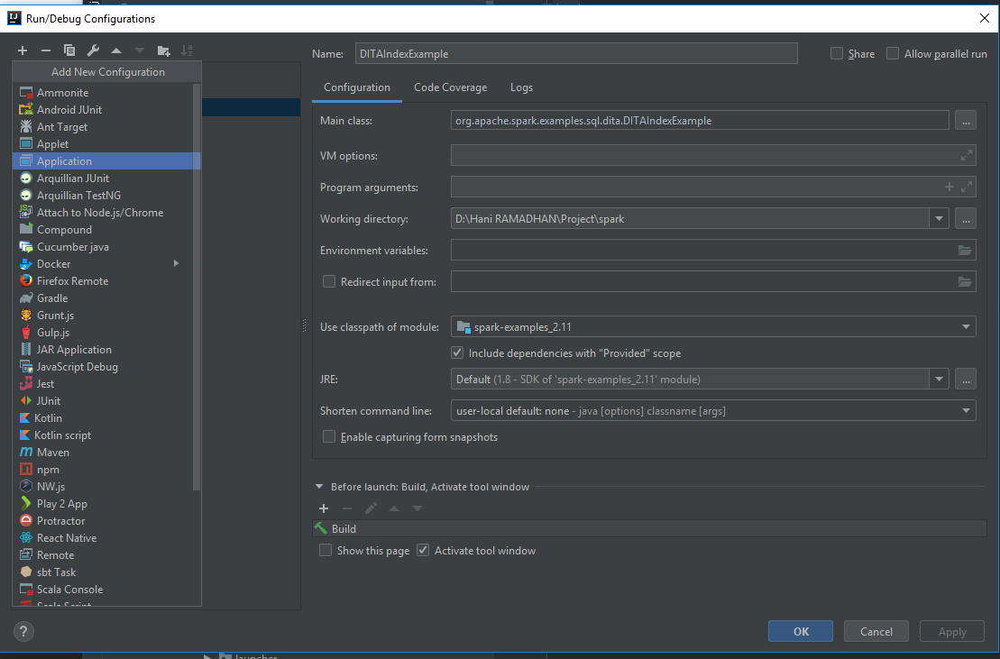
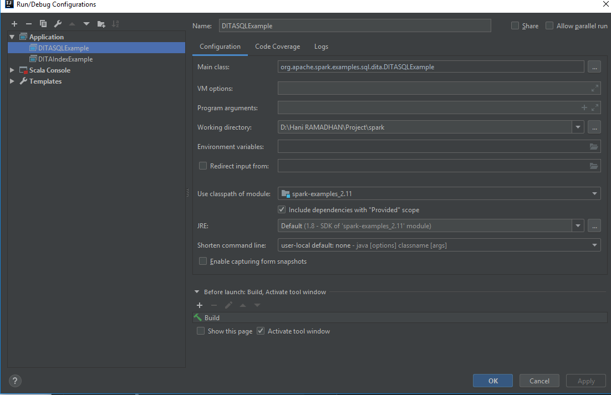
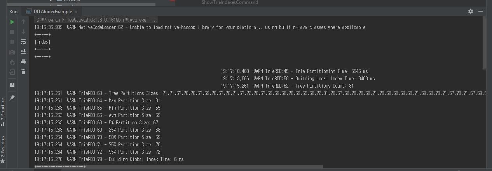

**Configuring Scala Examples for Intellij**

Example: DITA (https://github.com/TsinghuaDatabaseGroup/DITA)

First, we must configure the Scala application.

1. In IntelliJ, choose menu Run -> Edit Configurations... 

2. Click the button (+) in the upper left of the window. Then, pick Application.

2. Then, fill out the class name (Example: I am using the DITAIndexExample), the Working directory, and the classpath. Make sure that the 'Include dependencies with "Provided" scope' is checked. Then, click OK.

After that, we can nicely run the code and waiting for the results by choosing the menu Run -> Run 'DITAIndexExample'. The execution will run on the console as depicted below.

